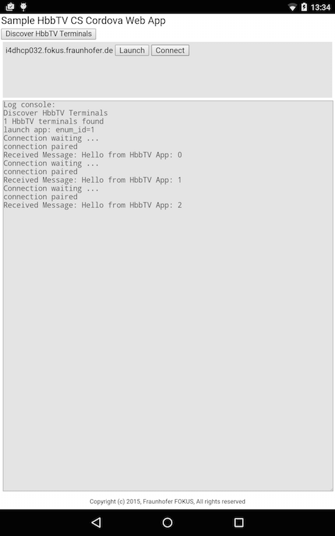

<!---
/*
 *
 * Copyright (c) 2015 Fraunhofer FOKUS, All rights reserved.
 *
 * This library is free software; you can redistribute it and/or
 * modify it under the terms of the GNU Lesser General Public
 * License as published by the Free Software Foundation; either
 * version 3.0 of the License, or (at your option) any later version.
 *
 * This library is distributed in the hope that it will be useful,
 * but WITHOUT ANY WARRANTY; without even the implied warranty of
 * MERCHANTABILITY or FITNESS FOR A PARTICULAR PURPOSE.  See the GNU
 * Lesser General Public License for more details.
 *
 * You should have received a copy of the GNU Lesser General Public
 * License along with this library. If not, see <http://www.gnu.org/licenses/>.
 *
 * AUTHORS: Louay Bassbouss (louay.bassbouss@fokus.fraunhofer.de)
 *
 */
-->

# HelloApp - Sample App using the [Cordova HbbTV Plugin](https://github.com/fraunhoferfokus/cordova-plugin-hbbtv)

This sample app bases on the standard Cordova sample app and extends it by
HbbTV 2.0 CS features using the [Cordova HbbTV Plugin](https://github.com/fraunhoferfokus/cordova-plugin-hbbtv).
Please refer to the [HbbTV 2.0 Spec document -> section 14 about Companion Screen][hbbtv20spec] for more details.

[Comments](https://github.com/fraunhoferfokus/cordova-plugin-hbbtv-helloapp/issues) and [contribution](https://github.com/fraunhoferfokus/cordova-plugin-hbbtv-helloapp/pulls) anytime welcome.

# Build and run instructions

Currently the [Cordova HbbTV Plugin](https://github.com/fraunhoferfokus/cordova-plugin-hbbtv) supports Android. iOS is work in progress and will be available soon.

## Android instructions

It is assumed that you have Android SDK installed, path to SDK binaries set
and have Cordova set up properly.

```
$ git clone https://github.com/fraunhoferfokus/cordova-plugin-hbbtv-helloapp
$ cd cordova-plugin-hbbtv-helloapp
$ cordova platform add android
$ cordova plugin add cordova-plugin-hbbtv
$ cordova build android
$ cordova run android
```

NOTE: the command `cordova plugin add cordova-plugin-hbbtv` may not be needed since Cordova installs required plugins listed in `config.xml`
(e.g. `<plugin name="cordova-plugin-hbbtv" version="0.0.2"/>` for the HbbTV plugin) automatically after adding a platform using `cordova platform add android`.
Alternatively to installing the Cordova plugin from the registry, the plugin can be installed by pointing to its repository on GitHub:

```$ cordova plugin add https://github.com/fraunhoferfokus/cordova-plugin-hbbtv.git```

## iOS instructions

coming soon ...

# Usage of the [Cordova HbbTV Plugin](https://github.com/fraunhoferfokus/cordova-plugin-hbbtv) in this App

The App files are available in the [www](www) folder. [cs-app.html](www/cs-app.html) is the main HTML file loaded when the
App is started. [js/cs-app.js](www/js/cs-app.js) is the main JavaScript file of this App. Please refer to it for more details
about the usage of the [Cordova HbbTV Plugin](https://github.com/fraunhoferfokus/cordova-plugin-hbbtv) in this App. Please also
refer to the [Cordova HbbTV Plugin Documentation](https://github.com/fraunhoferfokus/cordova-plugin-hbbtv/blob/master/doc/index.md)
to get more details about the Plugin APIs.

# Test

In order to test this Cordova App, a HbbTV 2.0 Terminal that implements the HbbTV 2.0 CS Spec is needed. First TV devices
that implement the HbbTV 2.0 Spec are expected in 2016. As alternative, the [Node.js HbbTV 2.0 CS module](https://www.npmjs.com/package/hbbtv)
can be used and started in `terminal` mode on a desktop PC. This Cordova App will discover the running Node.js HbbTV module as it is a real
HbbTV Terminal. Please refer to the [module documentation on npm](https://www.npmjs.com/package/hbbtv) for more details about how to install and run the module.

As next step, please start this Cordova App on a companion device (for now Android) and follow these steps:

1. Click on the `Discover HbbTV Terminals` button and wait few seconds.
1. After discovery is completed, the found HbbTV Terminals will appear in the div below the button.
   * Please make sure that the companion device and the PC are in the same network
1. Click on the `Launch` button for one of the discovered terminals.
   * The HbbTV App http://fraunhoferfokus.github.io/node-hbbtv/www/hbbtv-app.html will be launched on the PC in the default browser
1. Click on the `Connect` button for the same Terminal from previous step.
   * An App2App WebSocket channel between the Cordova App (Companion App) and the launched HbbTV App will be established.
   * Some text and binary messages will be exchanged and corresponding logs will be displayed in the Log console.
   * You can Click many times on the `Connect` button to create new channels

Below is a screenshot of this Cordova App on an Android tablet.



# License

Free for non commercial use released under the GNU Lesser General Public License v3.0, See [LICENSE file](LICENSE).

Contact us for commercial use <famecontact@fokus.fraunhofer.de>

Copyright (c) 2015 [Fraunhofer FOKUS](https://www.fokus.fraunhofer.de/)

### Contact

[Fraunhofer FOKUS - Competence Center FAME // Future Applications and Media](http://www.fokus.fraunhofer.de/fame)


[hbbtv20spec]: https://www.hbbtv.org/pages/about_hbbtv/HbbTV_specification_2_0.pdf